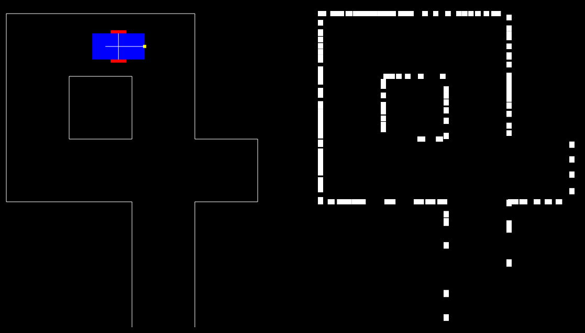

# Midterm Project Report

### Automatic exploring prototype

###目錄
*    [結果](#result)
*    [討論](#discussion)

<h3 id="result">結果</h3>

如圖所示，藍色的長方形是虛擬車，紅色細長的長方形在兩側代表輪子，黃色點所標的位置為車子的超音波距離感測器；灰色線條代表牆面，構成一張簡單的地圖。三軸加速器可使車子移動。按下鍵盤的 S 鍵後感測器的位置則會從最左邊旋轉到最右邊，每 10 度為一個單位，擷取 18 個點作為地圖探索資訊，並存放在陣列中，此為模擬超音波感測器的感測行為：先轉一個角度之後再發射超音波感測。每按一次 S 鍵就會新增 18 點在儲存陣列中，經多次感測之後在右側就會繪製出地圖。
<h3 id="discussion">討論</h3>
*    資料可信度  
　　資料點所標出的是障礙的位置，而那些資料點構成了障礙的輪廓，所以點愈密集所能呈現的障礙物樣貌就愈精確，反過來說點如果分佈太過零散就無法正確的辨別障礙、障礙的輪廓以及它的位置。因此如果後期要做到「自動探索」的話，必須要考慮到這個因素。

    *    解決方法  
    根據密集點所表現出的空間關係擬定車子的移動策略。（要有分辨空間關係的程式碼） 
    根據點的不同密度為其可能表現的空間關係做信任排序。

*    轉角、岔路分辨  
　　車子必須學會自己認路才能探索地圖，因此開發後期需要有能夠從目前探測點辨別空間關係的程式，也就是說，對所有收到的點進行處理之後轉換成能夠「指引方向」的資訊。

    *    解決方法  
    目前還沒有想到。

*    地圖結構化  
　　將地圖利用資料結構存在物件中，作為車子的導航指引。

    *    實現方式  
    用資料結構的 Graph 儲存，一個 node 代表一個岔路。之後就可用關於 Graph 的各式各樣的演算法來做想要的處理。
